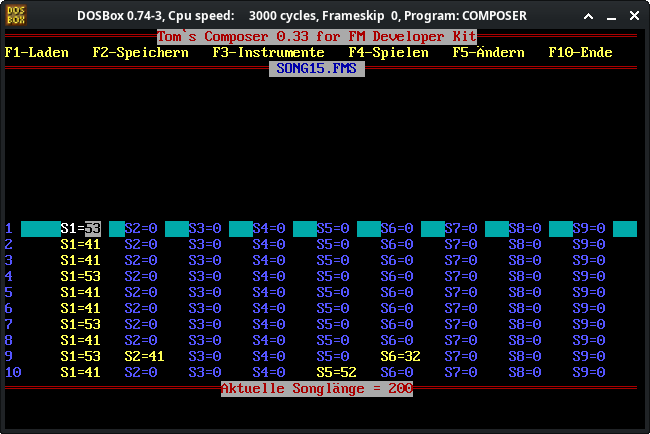
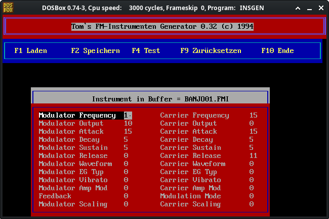

# TomsOldFMComposerReloaded

A easy to use OPL chip song composer. Using my file format [.fmi, .fms] from the 90s.

Each of the 9 channels are linked to a instrument. Simply add the notes and set the speed and song length. Thats it. 

---

.

---

## 📎 Libraries using OhmFlux Engine
- OpenGL
- Glew
- SDL3
- ImGui
- Box2D
- nlohmann json 
- stb
- ymdm

---

## 🏗 Build Instructions (Native Desktop)

Requires a C++20 compiler, **SDL3**, and **GLEW**.

```shell
# 1. Configure the project
cmake -S . -B build -DCMAKE_BUILD_TYPE=Release

# 2. Build everything
cmake --build build --config Release
```

---

## 📝 Notes

- The composer itself if feature complete. Goal was to implement a FMTPU compatible play/composer. 
- The File Browser will be become better since i'll work on it on OhmFlux Engine. 
- As an goodie it also includes a sfx generator ;)
- The OPLController was part of my OhmFlux Engine. But I'am working on the new version with OPL3 Support. 


---
---

# FMTPU for Turbo Pascal 6

by T. Hühn 1994

In the Folder ./pascal is  my source code of the FMTPU. I also added the DOS EXE which can be used with DosBox.

There are not all files to build in includes folder, since i don't know which Licences they are under. 

The includes/FMTPU.PAS file only uses DOS so not problem to use it ;)

The old instruments and some songs can be also be found in ./pascal/ADLIB





